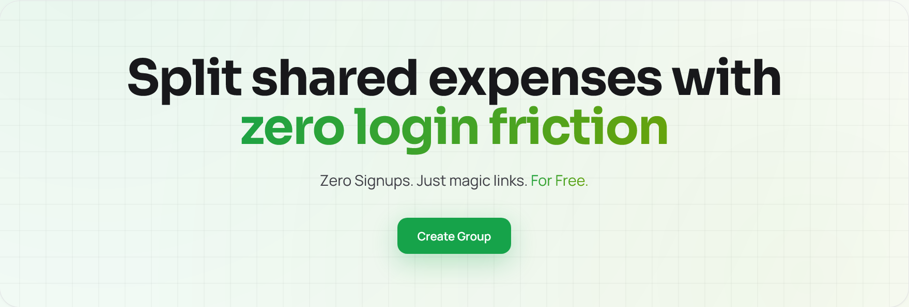
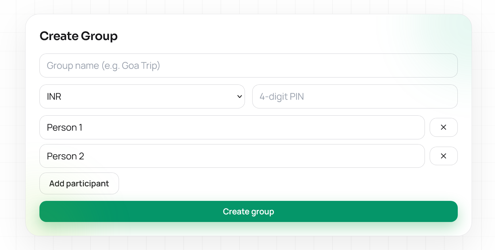
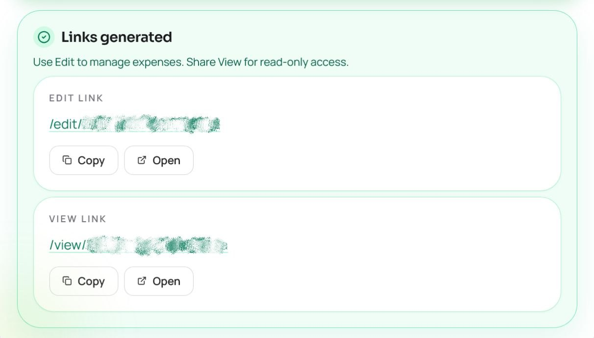
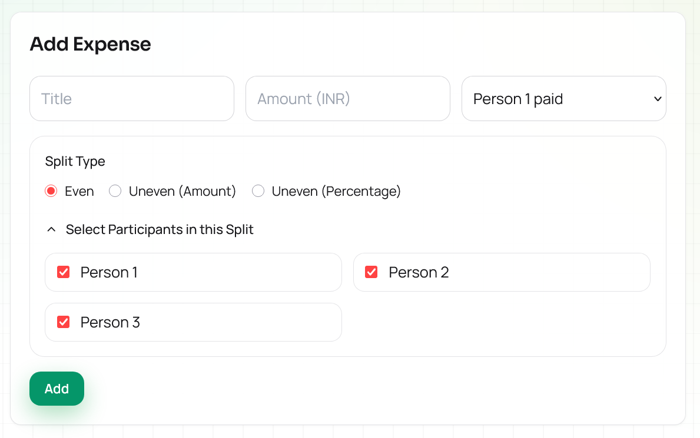
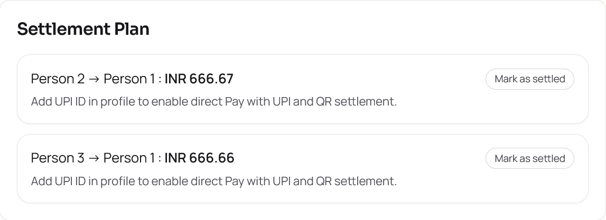
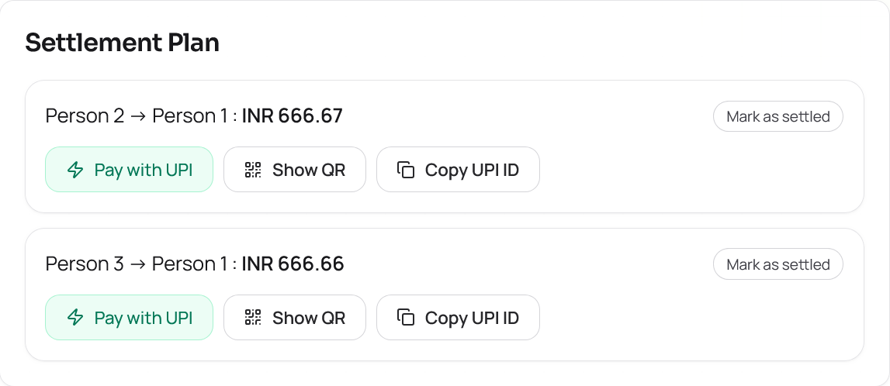
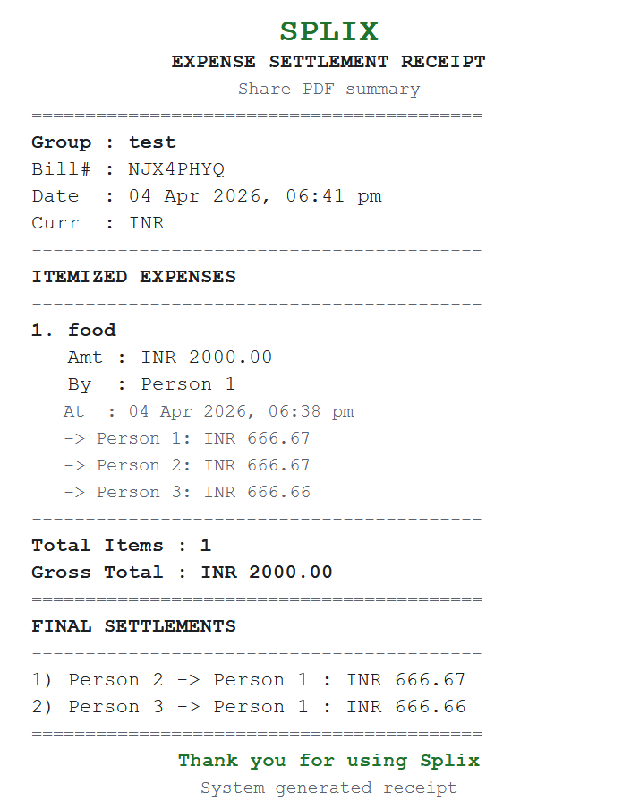

# Splix

Split shared expenses with zero login friction.

**Live Demo:** https://splix-app.vercel.app

Splix is a zero-friction group expense splitter built for the way people actually share bills: create a group, get an edit link and a view link, add expenses , and settle up instantly without forcing anyone through signups.

---

## Why Try Splix?

- No accounts, no OTPs, no signup wall
- Separate **Edit** and **View** links for cleaner sharing
- PIN-protected edit access
- Instant settlement plan with UPI support
- Receipt-style PDF export for a clean final summary
- Mobile-first UI designed for real group usage



---

## Walkthrough

### 1. Create a group in seconds
Set a group name, choose currency, create a 4-digit PIN, and add participants.
Use unique particpants name to avoid confusion.


### 2. Share the right link with the right people
- **Edit link** for trusted editors
- **View link** for read-only sharing

No account setup. No waiting around.



### 3. Add expenses with flexible splits
Track who paid and split costs using:
- even split
- uneven by amount
- uneven by percentage



### 4. Settle up fast
Splix simplifies balances into the minimum practical set of payments and supports:
- Pay with UPI
- QR-based settlement
- copy UPI flow
- manual mark-as-settled state



**after adding UPI ID**


### 5. Export a clean summary
Download a receipt-style PDF with:
- group details
- expense log
- final settlements
- totals



---

## Recommended Usage

To get the best experience with Splix:

- **Remember the group PIN**
  You will need it to unlock edit access later.

- **Save the Edit link somewhere safe**
  The edit link is the control link for your group.

- **Add your UPI ID in profile** 
  This enables faster direct settlement with Pay with UPI and QR.

- **Download the PDF when the trip or event ends** 
  It is the cleanest final summary to save or share.

---

## Built For

Splix works well for things like:
- trips
- flat expenses
- dinners and outings
- college group spends
- small event sharing

---

## Tech Stack

### Frontend
- React
- Vite
- React Router
- Tailwind CSS
- Framer Motion

### Backend
- Node.js
- Express
- Mongoose
- MongoDB
- Joi
- JWT
- pdf-lib

---

## For Devs

### Prerequisites

- Node.js 20.19+ or 22.12+
- MongoDB instance (local or Atlas)

### Installation

Clone the repository:

```bash
git clone https://github.com/piyushagr24/splix.git
cd splix
```

Install dependencies:

```bash
npm --prefix server install
npm --prefix client install
```

### Environment Setup

Create env files:
- `server/.env`
- `client/.env` (optional if using `http://localhost:4000`)

**`server/.env`**

```env
MONGODB_URI=your-mongodb-uri
JWT_SECRET=your-long-random-secret
JWT_EXPIRES_IN=7d
CORS_ORIGIN=http://localhost:5173
CLEANUP_INACTIVE_DAYS=45
```

**`client/.env`**

```env
VITE_API_BASE_URL=http://localhost:4000
```

### Run Locally

Start the backend:

```bash
npm --prefix server run dev
```

Start the frontend:

```bash
npm --prefix client run dev
```

Open:

```text
http://localhost:5173
```

### Manual Cleanup

Inactive groups can be cleaned manually.

Dry run:

```bash
npm --prefix server run cleanup:inactive-groups -- --dry-run
```

Actual cleanup:

```bash
npm --prefix server run cleanup:inactive-groups
```

Default retention window:
- `45` days
